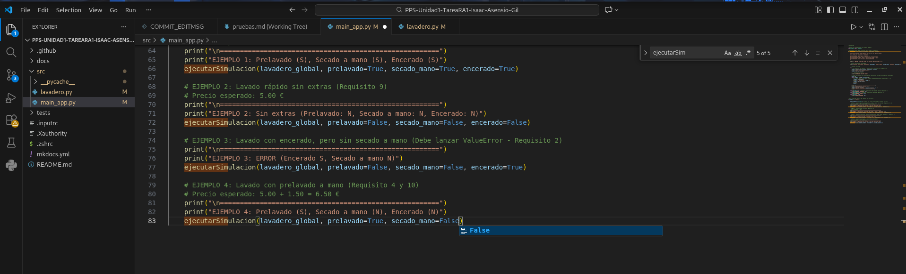

# Ejecución y depuración de la aplicación
---

## Ejecución desde Visual Code

He abierto el fichero `src/main_app.py` y he ejecutado la opcion de Run and Debug para la depuración para python.

Vi que estaba dando un error el **Ejemplo 4**

---

## Correción del error 

Observé que faltaba el parámetro `encerado`. Ya que la función pedia 4 parámetros obligatorios y solo se estaban pasando tres y por eso lanzaba el error.

Código mal : 

---

## Ejecución correcta del código

Muestro la parte del codigo cambiado :

---

Aqui muestro la **ejecucion** sin errores :

